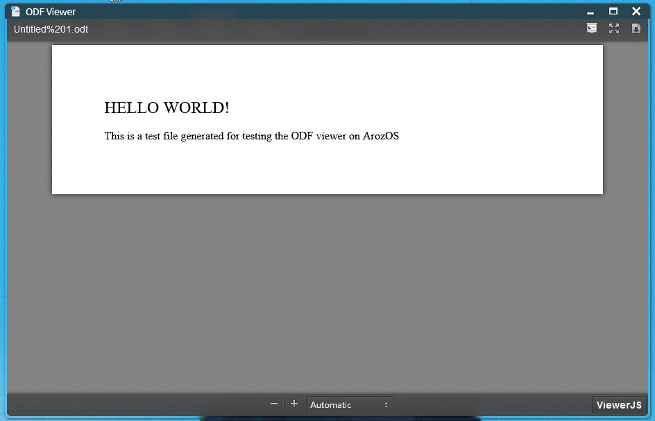

# ODF Viewer
The ODF Viewer WebApp that can be used in ArozOS to view Open Office files

This module is one of the legacy module from the ArOZ Online Beta project. Only install this if you are one of the fans of the Open Office family and want to continue using this viewer for your files when you are migrating to ArozOS 1.0. 

## Installation

1. Visit your ArozOS Web Desktop Interface, launch System Setting module
2. Go to "Module", select tab "Add & Remove Module"
3. Under the "New WebApp" section, find the sub-section "Install via Git Repository"
4. Fill in the URL of this repo (https://github.com/aroz-online/ODF-Viewer) and click "Install"
5. Do not close this window and wait until installation complete

## Preview

(Yes, this is basically just a port of the ViewerJS library)

## License

AGPL. See LICENSE file for more information

### Credits

This module is powered by the (legacy) [ViewerJS](https://viewerjs.org/) library. 

### FAQ

1. Why this module has to be installed separately?

   Ans: Because this is licensed under AGPL which is complex to deal with if this is included in the main repo
2. Why this UI looks so 2000s?

   Ans: Because this library haven't been updated since the 2000s.
3. Can I use this somewhere else?

   Ans: Yes. Please see the AGPL for all the requirement for using it somewhere else
